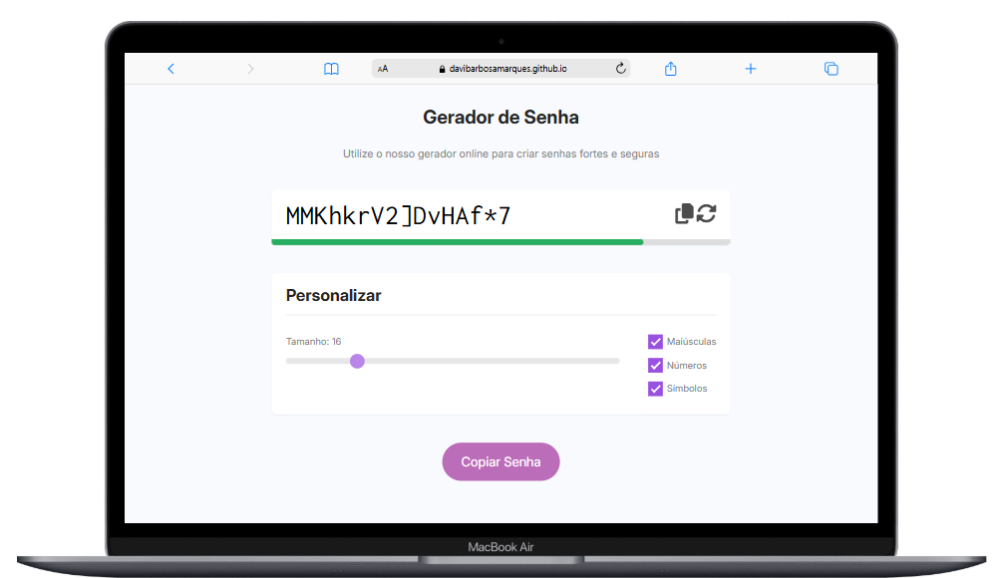

# 🛡️ Gerador de Senhas Seguras
<a href="https://davibarbosamarques.github.io/password-generator/" target="_blank">
    🔗 <strong>Visite o projeto aqui</strong>
</a>

Este é um gerador de senhas seguras feito com HTML, CSS e JavaScript.
Você pode personalizar completamente sua senha escolhendo:

✅ Tamanho (de 4 a 64 caracteres)

✅ Letras maiúsculas

✅ Números

✅ Caracteres especiais

Além disso, o gerador analisa a força da senha em tempo real! 🔒

## 📸 Prévia do Projeto

## 🛠 Tecnologias Utilizadas

O projeto foi desenvolvido utilizando as seguintes tecnologias:

  
  
  

- **HTML5** – Estrutura da interface
- **CSS3** – Estilização e responsividade
- **JavaScript** – Lógica para gerar senhas e avaliar segurança

## 🛠 Tecnologias Utilizadas

- Geração de senhas de 4 a 64 caracteres
- Opção de incluir/excluir:
    - Letras maiúsculas
    - Números
    - Caracteres especiais
- Avaliação da força da senha (fraca, média ou forte)
- Copiar senha com 1 clique